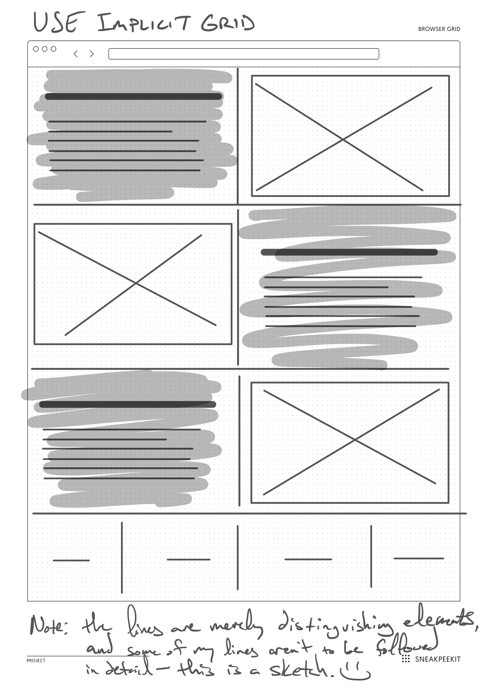
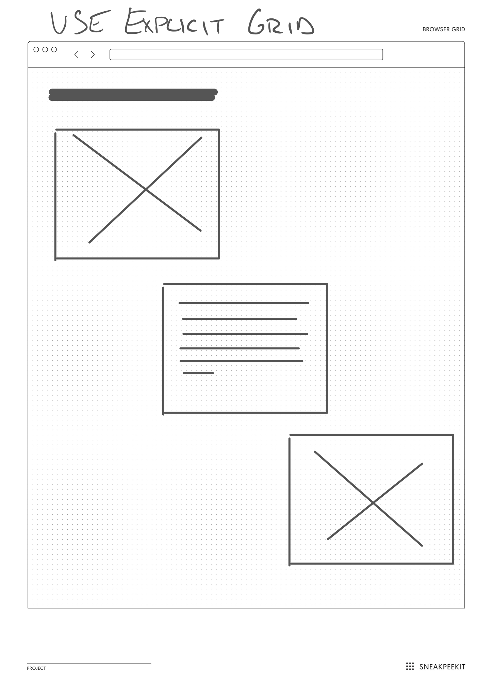
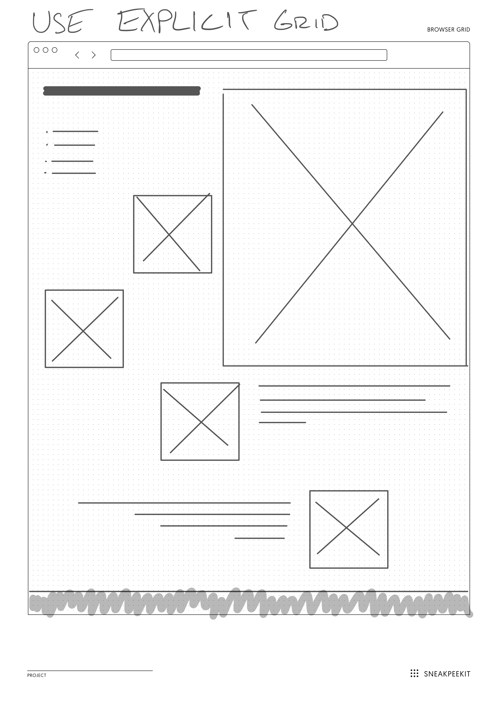

# Practicing Implicit and Explicit Grid Placements

## Logistics

**Goal**: Practice your HTML and CSS layout skills by recreating the 2 images at the bottom of this page as a website. Feel free to also include additional elements for practice and apply a simple color scheme.

**Due**: Thursday, 04/25/19 @ 2:00pm.

Follow the usual procedure:

1. Fork to your profile
2. Clone your forked version to your computer
3. Create your own folder within this root folder, as follows:
  1. Create a new folder with the name: <code>lastname-grid</code>, where "lastname" is your last name. **NOTE** the example folder with my name: <code>lindgren-grid</code>.
  2. Inside your specific folder,
    1. Create an implicit.html file and explicit.html file.
    2. Create an <code>assets</code> folder.
    3. Inside <code>assets</code>, create a <code>css</code> folder.
    4. Inside <code>css</code>, create a <code>style.css</code> file. Use this file for both pages.
4. Once you create this basic structure, then create a semantic version of the images below.
  - **DO NOT** use Atom's page rendering feature. Instead, practice designing this site with the **MOZILLA FIREFOX** browser's inspection tool. See the placholder options in the references section.
5. Once you've completed your practice site, follow the procedure: push the changes to your forked code reop, then create a pull request to the org.

## Implicit Grid

Use the wireframe below as your guide to create an implicit grid with some of the following general properties:

- 1 parent grid container with 6 children items.
- 1 parent grid container with 4 items.
- You must use the <code>fr</code> unit.
- Follow the remainder of the wireframe for guidance about what elements to put within the children grid items.

## Explicit Grid

Use the wireframe below as your guide to create an explicit grid with some of the following general properties:

- 1 parent grid container with 3 children items
- Follow the remainder of the wireframe for guidance about what elements to put within the children grid items.

## BONUS Explicit Grid (not required)

Use the wireframe below as your guide to create a bonus explicit grid with some of the following general properties. THIS IS NOT REQUIRED WORK, but you can earn 10 bonus points.

## Resources

- Placeholders: <a href="https://placeholder.com/" target="_blank">Images</a> &amp; <a href="https://placeholder.com/text/lorem-ipsum/" target="_blank">Standard Lorem Ipsum</a> and <a href="https://hipsum.co/" target="_blank">Hipster Ispum</a>
- Mozilla Developer Network: <a href="https://developer.mozilla.org/en-US/docs/Web/HTML" target="_blank">HTML</a>, <a href="https://developer.mozilla.org/en-US/docs/Web/CSS" target="_blank">CSS</a>
